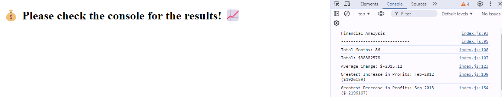
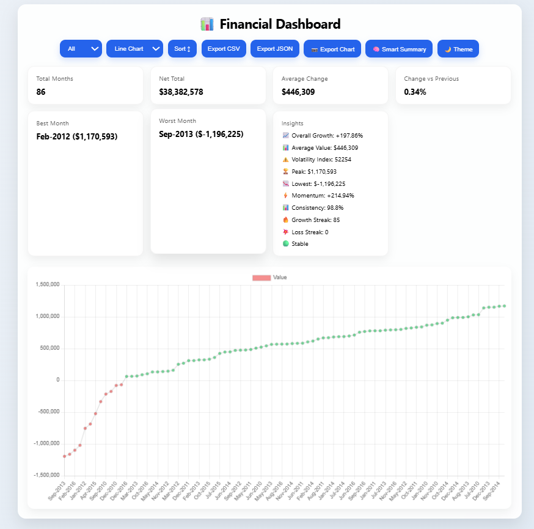
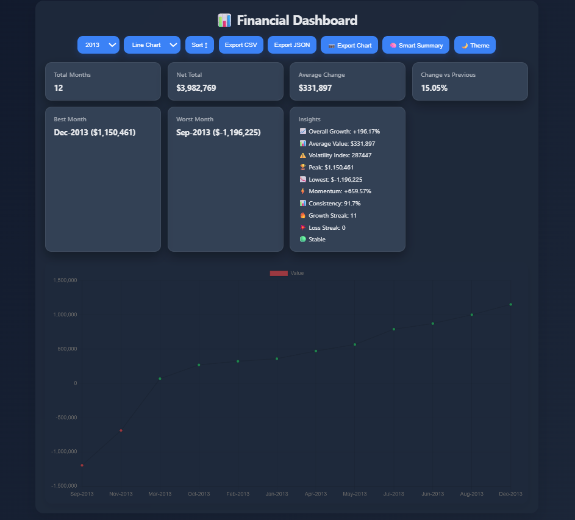

# Financial-Analysis-Dashboard

## 📌 Description
The Financial Analysis Dashboard is an interactive web-based data visualization tool built with HTML, CSS, and JavaScript. It transforms raw financial data into meaningful insights through dynamic charts, statistical summaries, and AI-style analytics.

The dashboard allows users to explore financial trends over time, filter data by year, switch visualization types, export datasets, and analyze performance metrics in a clean, responsive UI.

## 🛠 Prerequisites

To run this project, you only need:
* 🌐 A modern web browser (Chrome, Edge, Firefox, Safari)
  
## 📋 Features
Data Visualization
* Interactive charts using Chart.js
* Switch between Line and Bar chart views
* Color-coded values (positive vs negative performance)

Data Filtering & Sorting
* Filter data by year
* Sort values ascending or descending
* Dynamic dropdown populated from dataset

## 💻 Technologies Used
The application is built with the following technologies:
* HTML
* CSS
* JavaScript
* Chart.js
* LocalStorage
* SVG / Canvas rendering

## 🚀 Installation
No installation is required to use the app. It is hosted online and can be accessed via a web browser.

## 📚 Usage
1. Open the application dashboard in your browser.
2. Use controls to interact with data:
* 📅 Select year filter
* 📊 Change chart type
* ↕ Sort data
* 🌙 Toggle theme
3. View insights and performance metrics
4. Export data or download charts as needed

## 🔗 Live Demo & Repository
Application can be viewed here: 
* 🌐 Live: https://yvonnesarah.github.io/Financial-Analysis-Dashboard/
* 💻 Repository: https://github.com/yvonnesarah/Financial-Analysis-Dashboard

## 🖼 Screenshot(S)
Before Design

Console Finances

After Design

Financial Analysis Dashboard

Financial Analysis Dashboard - Dark Theme

## 🗺️ Roadmap (Planned Features)
Financial Analytics
* Total months tracked ✅
* Net total calculation ✅
* Average value analysis ✅
* Best and worst performing months ✅
* Month-to-month percentage change ✅

AI-Style Insights Engine
* Trend analysis (growth or decline) ✅
* Volatility index calculation ✅
* Momentum tracking ✅
* Consistency scoring ✅
* Risk classification (Stable → Extreme Risk) ✅
* Growth and loss streak detection ✅

## 🚀 Upcoming Features
Export & Download Tools
* Export dataset as CSV ✅
* Export dataset as JSON ✅
* Download chart as PNG image ✅

User Experience Features
* Dark / Light mode toggle (with persistence via localStorage) ✅
* Animated KPI counters ✅
* Smooth UI transitions and hover effects ✅
* Responsive layout for mobile and desktop ✅

## 🧠 Advanced Features (Professional Level)
Data Persistence
Saves user preferences:
* Selected year filter ✅
* Chart type ✅
* Theme mode ✅

Quick AI Summary
* Instant statistical overview (average, max, min values) ✅

## 🧠 Challenges & Learnings
🚧 Challenges Faced
1. Managing complex state without a framework
2. Keeping chart updates synchronized with filters
3. Handling dynamic statistical recalculations
4. Designing custom analytics logic (risk, volatility, momentum)
5. Ensuring smooth performance with full re-renders

📚 Key Learnings
1. Deepened understanding of vanilla JavaScript architecture
2. Improved data visualization skills using Chart.js
3. Learned how to simulate analytics systems without backend services
4. Gained experience in UI state persistence with LocalStorage
5. Strengthened modular and reusable function design

## 👥 Credit
Designed and developed by Yvonne Adedeji.

## 📜 License
This project is open-source. For licensing details, please refer to the LICENSE file in the repository.

## 📬 Contact
You can reach me at 📧 yvonneadedeji.sarah@gmail.com.
